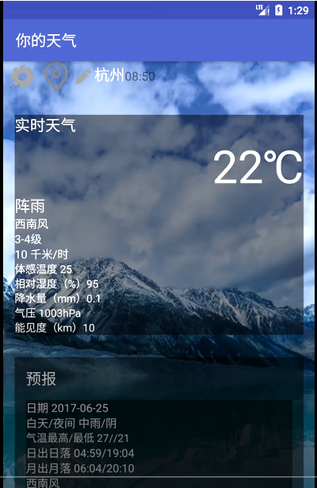
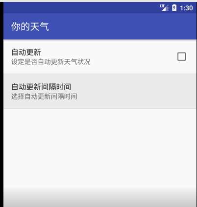

# TrWe

_A simple weather forecast app on Android platform_
_Thanks for heweather([和风天气](https://www.heweather.com/products/weather-api)), who provides some free calls to their apis for independent software developers_

## To use, debug & compile
- To use it, you need an Android device or an Android emulator. I used [Android Studio](https://developer.android.com/studio/index.html) to develop it. You can easily load this project into it, connect it to some devices and add more features.
- To debug it,first let your IDE the connect to the emulator or your Android device, and just do as what you have done to other programs before.
- To comiple it, the IDE can easily done that for you. You can also build your own tool chains(See [Gradle](https://gradle.org/)). 

## TODO
- [x] setting automatically update time
- [x] choose city
- [x] pull to refresh

## Effect
When running, it looks just as the follows

